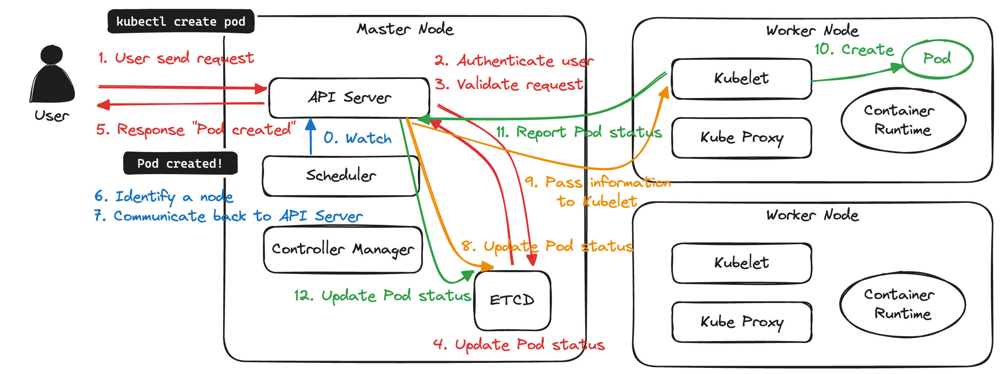

---
layout:
  title:
    visible: true
  description:
    visible: false
  tableOfContents:
    visible: true
  outline:
    visible: true
  pagination:
    visible: true
---

# API Server

API Server is the primary management component in Kubernetes.

## Responsibilities of API Server

1. Authenticate users
2. Validate requests
3. Retrieve data from ETCD
4. Update data to ETCD

The API Server is the ONLY components that interacts with ETCD. Controller Manager and Scheduler both update ETCD through API Server.

## How API Server works?

### Example: Getting Node Information

The image shows what exactly happened when retrieving the node information.

1. User send request to API Server via `kubectl get node` command or sending a POST request with `curl -x POST` command.
2. API Server authenticates the user who sent this request.
3. API Server validates the request.
4. API Server retrieves node information from the ETCD cluster.
5. API Server responds node information back to the user.

<figure><figcaption><p>What happens when getting node information?</p></figcaption></figure>

### Example: Creating a Pod

The image shows what exactly happened when creating a Pod.

1. User send request to API Server via `kubectl create pod` command or sending a POST request with `curl -x POST` command.
2. API Server authenticates the user who sent this request.
3. API Server validates the request.
4. API Server update Pod status to the ETCD cluster.
5. API Server responds "Pod Created" back to the user.
6. Scheduler continuously watches the API Server and realizes there's a Pod to be scheduled and identifies an appropriate node to place the new Pod.
7. Scheduler communicates back to API Server.
8. API Server update Pod status to the ETCD cluster.
9. API Server passes the information to the Kubelet in the appropriate Worker Node.
10. Kubelet creates the new Pod on the node and instructs the container runtime engine to deploy the application image.
11. Kubelet reports the Pod status to API Server.
12. API Server update Pod status to the ETCD cluster.

<figure><figcaption><p>What happens when creating a Pod?</p></figcaption></figure>

## Install API Server

### Setup Manually

```sh
wget https://storage.googleapis.com/kubernetes-release/release/v1.13.0/bin/linux/amd64/kube-apiserver
```

View the options.

```sh
cat /etc/systemd/system/kube-apiserver.service
```

```sh
# kube-apiserver.service

[Service]
ExecStart=/us/local/bin/kube-apiserver \\
  --advertise-address=${INTERNAL_IP} \\
  --allow-privileged=true \\
  --apiserver-count=3 \\
  --audit-log-maxage=30 \\
  --audit-log-maxbackup=3 \\
  --audit-log-maxsize=100 \\
  --audit-log-path=/var/log/audit.log \\
  --authorization-mode=Node,RBAC \\
  --bind-address=0.0.0.0 \\
  --client-ca-file=/var/lib/kubernetes/ca.pem \\
  --enable-admission-plugins=Initializers,NamespaceLifecycle,NodeRestriction,LimitRanger,ServiceAccount,DefaultstorageClass,ResourceQuota \\
  --enable-swagger-ui=true \\
  --etcd-cafile=/var/lib/kubernetes/ca.pem \\
  --etcd-certfile=/var/lib/kubernetes/kubernetes.pem \\
  --etcd-keyfile=/var/lib/kubernetes/kubernetes-key.pem \\
  --etcd-servers=https://10.240.0.10:2379,https://10.240.0.11:2379,https://10.240.0.12:2379 \\
  --event-ttl=1h \\
  --experimental-encryption-provider-config=/var/lib/kubernetes/encryption-config.yaml \\
  --kubelet-certificate-authority=/var/lib/kubernetes/ca.pem \\
  --kubelet-client-certificate=/var/lib/kubernetes/kubernetes.pem \\
```

* `--etcd-cafile`, `--etcd-certfile`, and `--etcd-keyfile`: Certification configs of ETCD.
* `--kubelet-certificate-authority`, `--kubelet-client-key`, and `--kubelet-client-key`: Certification configs of Kubelet.
* `--etcd-servers`: Config how the API Server connects to ETCD Server.

### Setup with Kubeadm

If the Kubernetes cluster is set with Kubeadm, then the API Server was deployed as a pod in `kube-system` Namespace.

```sh
kubectl get pods -n kube-system
```

```sh
NAMESPACE     NAME                            READY  STATUS    RESTARTS   AGE
kube-system   coredns-78fcdf6894-alezl        1/1    Running   0          1h
kube-system   coredns-78fcdf6894-ep7oq        1/1    Running   0          1h
kube-system   etcd-master                     1/1    Running   0          1h
kube-system   kube-apiserver-master           1/1    Running   0          1h
kube-system   kube-controller-manager-master  1/1    Running   0          1h
kube-system   kube-proxy-ke3r6                1/1    Running   0          1h
kube-system   kube-proxy-ejitw                1/1    Running   0          1h
kube-system   kube-scheduler-master           1/1    Running   0          1h
kube-system   weave-net-ifjkf                 2/2    Running   1          1h
kube-system   weave-net-cerze                 2/2    Running   1          1h
```

View the options.

```sh
cat /etc/kubernetes/manifests/kube-apiserver.yaml
```

<pre class="language-sh"><code class="lang-sh">spec:
  containers:
<strong>  - command:
</strong>    - kube-apiserver
    - --authorization-mode=Node,RBAC
    - --advertise-address=172.17.0.32
    - --allow-privileged=true
    - --client-ca-file=/etc/kubernetes/pki/ca.crt
    - --disable-admission-plugins=PersistentVolumeLabel
    - --enable-admission-plugins=NodeRestriction
    - --enable-bootstrap-token-auth=true
    - --etcd-cafile=/etc/kubernetes/pki/etcd/ca.crt
    - --etcd-certfile=/etc/kubernetes/pki/apiserver-etcd-client.crt
    - --etcd-keyfile=/etc/kubernetes/pki/apiserver-etcd-client.key
    - --etcd-servers=https://127.0.0.1:2379
    - --insecure-port=0
    - --kubelet-client-certificate=/etc/kubernetes/pki/apiserver-kubelet-client.crt
    - --kubelet-client-key=/etc/kubernetes/pki/apiserver-kubelet-client.key
    - --kubelet-preferred-address-types=InternalIP,ExternalIP,Hostname
    - --proxy-client-cert-file=/etc/kubernetes/pki/front-proxy-client.crt
    - --proxy-client-key-file=/etc/kubernetes/pki/front-proxy-client.key
    - --requestheader-allowed-names=front-proxy-client
    - --requestheader-client-ca-file=/etc/kubernetes/pki/front-proxy-ca.crt
    - --requestheader-extra-headers-prefix=X-Remote-Extra-
    - --requestheader-group-headers=X-Remote-Group
    - --requestheader-username-headers=X-Remote-User
</code></pre>

View the running process.

```sh
ps-aux | grep kube-apiserver
```


```sh
root    2333  2.3  17.4  382140  312344 ?     Ssl    15:46   1:22 kube-apiserver --authorization-mode=Node,RBAC --advertise-address=172.17.0.32 --allow-privileged=true --client-ca-file=/etc/kubernetes/pki/ca.crt --disable-admission-plugins=PersistentVolumeLabel --enable-admission-plugins=NodeRestriction --enable-bootstrap-token-auth=true --etcd-cafile=/etc/kubernetes/pki/etcd/ca.crt --etcd-certfile=/etc/kubernetes/pki/apiserver-etcd-client.crt --etcd-keyfile=/etc/kubernetes/pki/apiserver-etcd-client.key --etcd-servers=https://127.0.0.1:2379 --insecure-port=0 --kubelet-client-certificate=/etc/kubernetes/pki/apiserver-kubelet-client.crt --kubelet-client-key=/etc/kubernetes/pki/apiserver-kubelet-client.key --kubelet-preferred-address-types=InternalIP,ExternalIP,Hostname --proxy-client-cert-file=/etc/kubernetes/pki/front-proxy-client.crt --proxy-client-key-file=/etc/kubernetes/pki/front-proxy-client.key--requestheader-allowed-names=front-proxy-client --requestheader-client-ca-file=/etc/kubernetes/pki/front-proxy-ca.crt --requestheader-extra-headers-prefix=X-Remote-Extra- --requestheader-group-headers=X-Remote-Group --requestheader-username-headers=X-Remote-User --secure-port=6443 --service-account-key-file=/etc/kubernetes/pki/sa.pub --service-cluster-ip-range=10.96.0.0/12 --tls-cert-file=/etc/kubernetes/pki/apiserver.crt --tls-private-key-file=/etc/kubernetes/pki/apiserver.key
```

