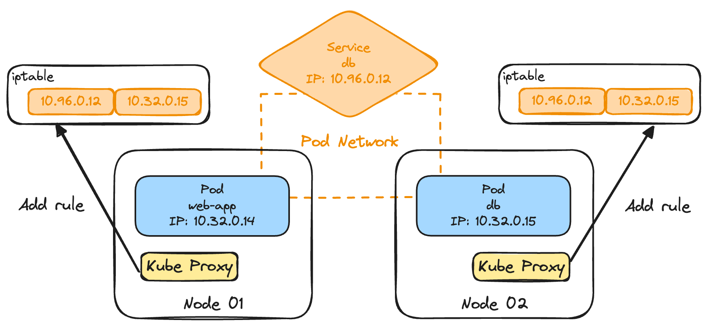

---
layout:
  title:
    visible: true
  description:
    visible: false
  tableOfContents:
    visible: true
  outline:
    visible: true
  pagination:
    visible: true
---

# Kube Proxy

Kube Proxy is a process that runs on each Node in the Kubernetes cluster. It is responsible for looking for new Services and creating the appropriate rules on each Node to forward traffic to those services to the backend Pods.

## How Kube Proxy Works?

1. When a Service is created, an IP is assigned to it, that is `10.96.0.12` in this case.
2. Kube Proxy adds the Service and Pod pair IPs (`10.96.0.12` and `10.32.0.15`) to the iptable on each Node.
3. The traffic route to the Service (`10.96.0.12`) will be directly forward to the Pod (`10.32.0.15`).

<figure><figcaption><p>How Kube Proxy works?</p></figcaption></figure>

## Install Kube Proxy

### Setup Manually

Unlike other components, Kubeadm doesn't deploy Kubelet. Kubelet can only be deployed manually.

```sh
wget https://storage.googleapis.com/kubernetes-release/release/v1.13.0/bin/linux/amd64/kube-proxy
```

View the options.

```sh
cat /etc/systemd/system/kube-proxy.service
```

```sh
# kube-proxy.service

ExecStart=/usr/local/bin/kube-proxy \\
  --config=/var/lib/kube-proxy/kube-proxy-config.yaml
Restart=on-failure
RestartSec=5
```

### Setup with Kubeadm

If the Kubernetes cluster is set with Kubeadm, then the Kube Proxy was deployed as a pod in `kube-system` Namespace.

```sh
kubectl get pods -n kube-system
```

```sh
NAMESPACE     NAME                            READY  STATUS    RESTARTS   AGE
kube-system   coredns-78fcdf6894-alezl        1/1    Running   0          1h
kube-system   coredns-78fcdf6894-ep7oq        1/1    Running   0          1h
kube-system   etcd-master                     1/1    Running   0          1h
kube-system   kube-apiserver-master           1/1    Running   0          1h
kube-system   kube-controller-manager-master  1/1    Running   0          1h
kube-system   kube-proxy-ke3r6                1/1    Running   0          1h
kube-system   kube-proxy-ejitw                1/1    Running   0          1h
kube-system   kube-scheduler-master           1/1    Running   0          1h
kube-system   weave-net-ifjkf                 2/2    Running   1          1h
kube-system   weave-net-cerze                 2/2    Running   1          1h
```

Kube Proxy is deployed through DaemonSets.

```sh
kubectl get daemonset -n kube-system
```

```sh
NAME        DESIRED  CURRENT  READY  UP-TO-DATE AVAILABLE NODE SELECTOR                   AGE
kube-proxy  2        2        2      2          2         beta.kubernetes.io/arch=amd64   1h
```

View the options.

```sh
cat /etc/kubernetes/manifests/kube-scheduler.yaml
```

```sh
spec:
  containers:
  - command:
    - kube-scheduler
    - --address=127.0.0.1
    - --kubeconfig=/etc/kubernetes/scheduler.conf
    - --leader-elect=true
```
